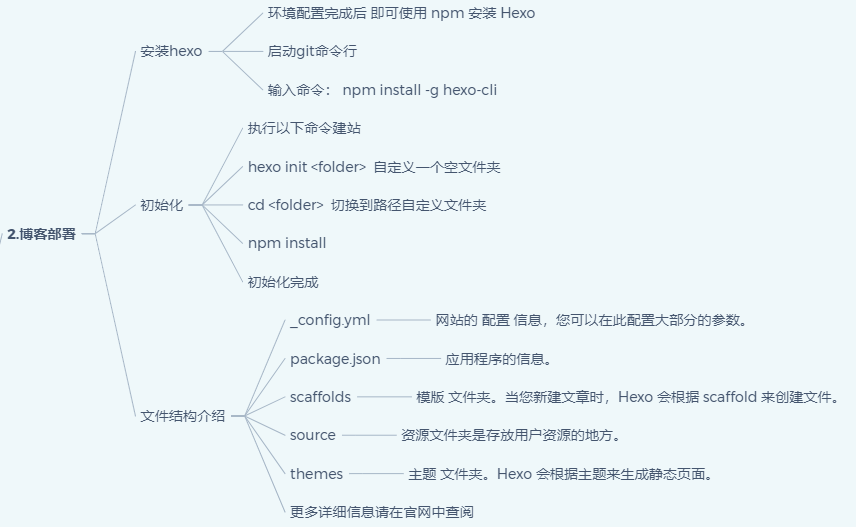
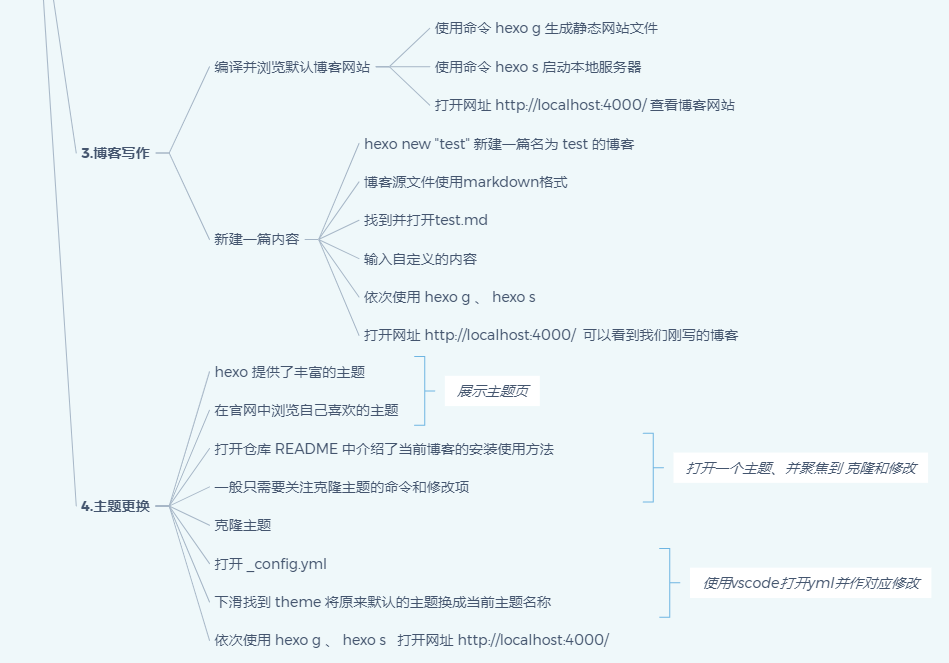

1. 先确定视频的【目的】，明确【视频类型】，例如市场宣传、功能简介、操作详解等。

2. 头脑风暴罗列一下视频里面要传递的信息，做一个【信息列表】。这个阶段可以先发散再删减，列的时候先不用考虑章节结构。这个信息列表再根据【重要性】和【依赖关系】，经过删减，把要传递的信息整理成一个树状关系。如果发现信息太多，很可能进一步删减或者需要拆成多个视频。

3. 画视频的【思维导图】：视频的章节结构，每个部分要讲哪些信息。对照信息列表，看看是不是覆盖了。

4. 从思维导图，出【解说词】，然后是【分镜头】，解说词和分镜头很可能需要来回修改，但是解说词优先级更高。

5. 对着解说词和分镜头草稿，人工讲一下，类似讲ppt，这个过程很可能发现有地方不对劲，就需要向前回溯修改。

6. 最后再剪辑视频。

下图是一个思维导图，用于总结视频的结果、词稿、分镜等。

